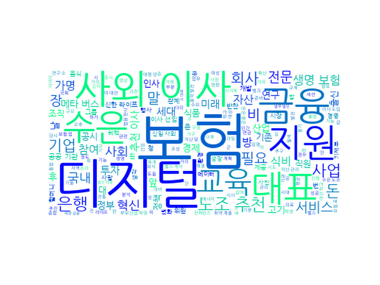

## Daily News Monitoring 

2021-09-18 

----------

### Daily Hot Keywords 

----------

*[ESG 소식]*

1. 수출입은행, 금융권 첫 노조추천 사외이사 임명 [0] ([Link](https://news.naver.com/main/read.naver?mode=LSD&mid=sec&sid1=101&oid=011&aid=0003964194))

2. 17일 장 마감 후 주요 종목 뉴스 [0] ([Link](https://news.naver.com/main/read.naver?mode=LSD&mid=sec&sid1=101&oid=018&aid=0005040446))

3. 수출입은행, 금융권 첫 노조추천 사외이사 임명 [0] ([Link](https://news.naver.com/main/read.naver?mode=LSD&mid=sec&sid1=101&oid=008&aid=0004646899))

4. 한수원, '친환경에너지 ESG'로 탄소중립 앞당긴다 [0] ([Link](https://news.naver.com/main/read.naver?mode=LSD&mid=sec&sid1=102&oid=079&aid=0003554847))

5. 금융권 첫 노조 추천 사외이사 탄생…文 대통령 공약 5년 만 결실(종합) [7] ([Link](https://news.naver.com/main/read.naver?mode=LSD&mid=sec&sid1=101&oid=277&aid=0004971546))

----------

*[금융 소식]*

1. 헝가리서 비트코인 지지자들, 비트코인 개발자 조각상 세워 [0] ([Link](https://news.naver.com/main/read.naver?mode=LSD&mid=sec&sid1=104&oid=055&aid=0000922033))

----------

*[보험 소식]*

1. "킥보드 혼자 넘어졌는데, 3m 떨어진 차 '뺑소니' 신고"…블랙박스 살펴보니 [1780] ([Link](https://news.naver.com/main/read.naver?mode=LSD&mid=sec&sid1=102&oid=009&aid=0004854267))

2. 최경자 경기도의원, 미인가 대안학교 ‘의정부 중원학교’ 운영비 지원 논의 [0] ([Link](https://news.naver.com/main/read.naver?mode=LSD&mid=sec&sid1=004&oid=081&aid=0003217059))

3. [제보] ‘둘레길-수렵허가구역’ 구분 안 돼…방문객 위험 노출 [43] ([Link](https://news.naver.com/main/read.naver?mode=LSD&mid=sec&sid1=102&oid=056&aid=0011123018))

4. 함평군, 영세 자영업자에 긴급 민생지원금 지급 [0] ([Link](https://news.naver.com/main/read.naver?mode=LSD&mid=sec&sid1=102&oid=002&aid=0002210946))

----------

*[보험 헬스케어 소식]*

1. “MZ세대가 우리의 미래”...라이프 위한 보험 꿈꾸는 ‘로지 아빠’ [피플 & 스토리-성대규 신한라이프 사장] [0] ([Link](https://news.naver.com/main/read.naver?mode=LSD&mid=sec&sid1=101&oid=016&aid=0001889229))

2. [피플앤스토리] 라이프를 위한 보험 꿈꾸는 ‘로지 아빠’ 성대규…“MZ세대가 우리의 미래죠” [0] ([Link](https://news.naver.com/main/read.naver?mode=LSD&mid=sec&sid1=101&oid=016&aid=0001889027))

3. 이미 온 미래 축제 '4차산업혁명 페스티벌' 다음달 6일 개막 [3] ([Link](https://news.naver.com/main/read.naver?mode=LSD&mid=sec&sid1=105&oid=092&aid=0002234032))

4. 못 먹어서 아프고, 아파서 더 못먹고... “개밥 같아, 허픈 인생” [이슈&탐사] [15] ([Link](https://news.naver.com/main/read.naver?mode=LSD&mid=sec&sid1=102&oid=005&aid=0001471519))

----------

*[헬스케어 소식]*

1. 중국 중앙은행 유동성 공급에 고전하던 중화권 증시 상승 [0] ([Link](https://news.naver.com/main/read.naver?mode=LSD&mid=sec&sid1=104&oid=277&aid=0004971552))

2. 중국판 리먼 사태?…'빚 350조원' 헝다그룹 파산 위기 [29] ([Link](https://news.naver.com/main/read.naver?mode=LSD&mid=sec&sid1=104&oid=437&aid=0000276454))

