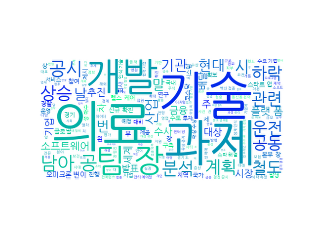

## Daily News Monitoring 

2021-12-04 

----------

### Daily Hot Keywords 

----------

*[금융 소식]*

1. IMF때 대박 터졌던 "부자 되세요" 20년만에 이달소 '츄'가 외친다 [13] ([Link](https://news.naver.com/main/read.naver?mode=LSD&mid=sec&sid1=101&oid=009&aid=0004888719))

2. 경찰,성매수자 790여명 입건 …현직경찰관도 2명 포함 [15] ([Link](https://news.naver.com/main/read.naver?mode=LSD&mid=sec&sid1=102&oid=081&aid=0003235026))

3. [인사] SK증권 [0] ([Link](https://news.naver.com/main/read.naver?mode=LSD&mid=sec&sid1=102&oid=031&aid=0000640404))

4. 中·라오스 1035㎞ 잇는 고속철 개통 “중국 자본·기술로 식민지화 우려” [34] ([Link](https://news.naver.com/main/read.naver?mode=LSD&mid=sec&sid1=104&oid=023&aid=0003657326))

----------

*[보험 소식]*

1. '오미크론 확산' 남아공 하루 1만명 추가 확진 [13] ([Link](https://news.naver.com/main/read.naver?mode=LSD&mid=sec&sid1=104&oid=018&aid=0005099981))

2. '오미크론 확산' 남아공 하루 1만명 확진…감염재생산 역대최고 [1] ([Link](https://news.naver.com/main/read.naver?mode=LSD&mid=sec&sid1=104&oid=016&aid=0001920503))

3. 치솟는 배달비, 음식값의 1/3…자영업자·소비자 한숨 [254] ([Link](https://news.naver.com/main/read.naver?mode=LSD&mid=sec&sid1=101&oid=448&aid=0000345595))

----------

*[보험 헬스케어 소식]*

1. 코스피 장초반 0.4% 하락 2930선…리오프닝株↑·진단키트↓ [1] ([Link](https://news.naver.com/main/read.naver?mode=LSD&mid=sec&sid1=101&oid=421&aid=0005762292))

2. 기관 매도세에…코스피 장 초반 하락세 [2] ([Link](https://news.naver.com/main/read.naver?mode=LSD&mid=sec&sid1=101&oid=277&aid=0005009763))

3. 창업진흥원, 글로벌 바이오 기업과 스타트업 협업 기반 만들어 [0] ([Link](https://news.naver.com/main/read.naver?mode=LSD&mid=sec&sid1=101&oid=277&aid=0005009702))

4. 대스타 해결사 플랫폼 바이오 결선…7개 스타트업 대상 [0] ([Link](https://news.naver.com/main/read.naver?mode=LSD&mid=sec&sid1=101&oid=003&aid=0010868671))

----------

*[헬스케어 소식]*

1. 현대모비스, 영화 속에서만 봤던 ‘생체인식기술’ 양산 성공… “대형차 사고 방지 기대” [0] ([Link](https://news.naver.com/main/read.naver?mode=LSD&mid=sec&sid1=103&oid=020&aid=0003397657))

2. "디지털 대전환 시대, SW 방향은?" 2022 SW 산업전망 컨퍼런스 성료 [0] ([Link](https://news.naver.com/main/read.naver?mode=LSD&mid=sec&sid1=105&oid=009&aid=0004888677))

3. 3일 장 마감 후 주요 종목 뉴스 [0] ([Link](https://news.naver.com/main/read.naver?mode=LSD&mid=sec&sid1=101&oid=018&aid=0005099952))

4. 장 마감 후 기업공시[12월 3일] [0] ([Link](https://news.naver.com/main/read.naver?mode=LSD&mid=sec&sid1=101&oid=011&aid=0003992865))

5. 광주시·전남도 "초광역 협력으로 상생발전" [0] ([Link](https://news.naver.com/main/read.naver?mode=LSD&mid=sec&sid1=102&oid=629&aid=0000119716))

6. 아·태 안티에이징 컨퍼런스 메디시티 대구서 개막 [0] ([Link](https://news.naver.com/main/read.naver?mode=LSD&mid=sec&sid1=102&oid=015&aid=0004636584))

