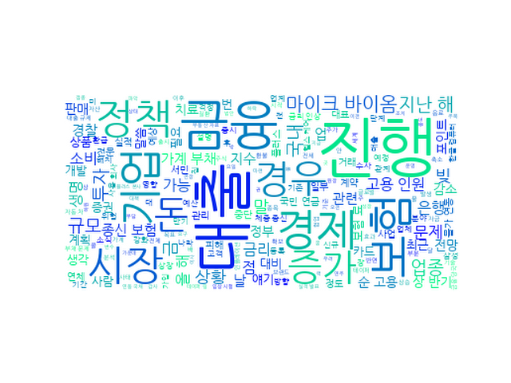

## Daily News Monitoring 

2021-08-26 

----------

### Daily Hot Keywords 

----------

*[ESG 소식]*

----------

*[금융 소식]*

1. [뉴스하이킥] 조남희 "정부, 과도한 시장개입 멈추고 대출정책 유연하게 풀어가야" [3] ([Link](https://news.naver.com/main/read.naver?mode=LSD&mid=sec&sid1=100&oid=214&aid=0001144262))

2. 인플레에 쉽게 투자할 수 없을까?…물가채 ETN 두달새 9% [1] ([Link](https://news.naver.com/main/read.naver?mode=LSD&mid=sec&sid1=101&oid=018&aid=0005019751))

3. [뉴스하이킥] 홍춘욱 "금리, 앞으로 한두번 더 올릴 것" [2] ([Link](https://news.naver.com/main/read.naver?mode=LSD&mid=sec&sid1=100&oid=214&aid=0001144263))

4. 경찰, '환불 중단' 머지플러스 12시간 압수수색 [6] ([Link](https://news.naver.com/main/read.naver?mode=LSD&mid=sec&sid1=102&oid=016&aid=0001879038))

5. 경찰 '대규모 환불 대란' 머지플러스 압수수색…12시간만에 종료 [3] ([Link](https://news.naver.com/main/read.naver?mode=LSD&mid=sec&sid1=102&oid=008&aid=0004636324))

6. 뉴욕증시, 고점 부담 속에 혼조세로 출발 [0] ([Link](https://news.naver.com/main/read.naver?mode=LSD&mid=sec&sid1=101&oid=001&aid=0012621470))

7. 숨고르기 장세 속 '돈나무 언니'는 이 종목 샀다 [뉴욕증시 나우] [9] ([Link](https://news.naver.com/main/read.naver?mode=LSD&mid=sec&sid1=101&oid=215&aid=0000980649))

----------

*[보험 소식]*

1. “사망보험금이 매년 올라가요” 현혹…보험사 ‘체증형 종신’ 가입 유도 급증 [0] ([Link](https://news.naver.com/main/read.naver?mode=LSD&mid=sec&sid1=101&oid=032&aid=0003094131))

2. 500대 기업 상반기 순고용 5300명 늘었다…삼성전자 1위(종합) [1] ([Link](https://news.naver.com/main/read.naver?mode=LSD&mid=sec&sid1=101&oid=003&aid=0010683677))

3. 충청북도, 제2회 추경안 5,664억 원 증액 편성 [0] ([Link](https://news.naver.com/main/read.naver?mode=LSD&mid=sec&sid1=101&oid=056&aid=0011108172))

----------

*[업계 소식]*

1. 저축은행 이어 보험사·카드사도 대출받기 어려워진다 [16] ([Link](https://news.naver.com/main/read.naver?mode=LSD&mid=sec&sid1=101&oid=028&aid=0002557942))

2. 브랜드 ‘맛’ 담았다… 보험사가 ‘맥주·요구르트’ 파는 이유 [0] ([Link](https://news.naver.com/main/read.naver?mode=LSD&mid=sec&sid1=101&oid=417&aid=0000728527))

----------

*[헬스케어 소식]*

1. "이젠 클라우드·메타버스株"…사업 다각화로 주목받는 한컴 [1] ([Link](https://news.naver.com/main/read.naver?mode=LSD&mid=sec&sid1=101&oid=015&aid=0004596009))

2. 유니티, ‘유니티 포 휴머니티 서밋 2021’ 개최…美아티스트 커먼 기조연설 [0] ([Link](https://news.naver.com/main/read.naver?mode=LSD&mid=sec&sid1=105&oid=468&aid=0000785799))

3. 한국콜마, 인체 미생물로 신약 만든다 [0] ([Link](https://news.naver.com/main/read.naver?mode=LSD&mid=sec&sid1=101&oid=011&aid=0003954466))

