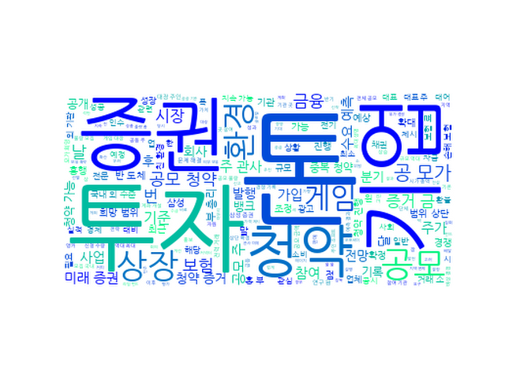

## Daily News Monitoring 

2021-07-30 

----------

### Daily Hot Keywords 

----------

*[ESG 소식]*

1. 미래에셋, 서부발전 원화 녹색채권 2700억 발행 [0] ([Link](https://news.naver.com/main/read.naver?mode=LSD&mid=sec&sid1=101&oid=014&aid=0004683934))

2. 전력거래소 ‘커피박 친환경 재자원화’ 킥오프 회의 열어 [0] ([Link](https://news.naver.com/main/read.naver?mode=LSD&mid=sec&sid1=102&oid=002&aid=0002202526))

----------

*[금융 소식]*

1. 카카오뱅크 환불 57조 어디로…HK이노엔? 크래프톤? [15] ([Link](https://news.naver.com/main/read.naver?mode=LSD&mid=sec&sid1=101&oid=018&aid=0004998394))

2. 전기전자株 호실적에도 반년간 박스권…반등은 언제? [16] ([Link](https://news.naver.com/main/read.naver?mode=LSD&mid=sec&sid1=101&oid=018&aid=0004998392))

3. [설왕설래] 양치기 소년 [0] ([Link](https://news.naver.com/main/read.naver?mode=LSD&mid=sec&sid1=110&oid=022&aid=0003605253))

4. [ESG동향] 함부로 친환경을 말하지 말라 [0] ([Link](https://news.naver.com/main/read.naver?mode=LSD&mid=sec&sid1=110&oid=022&aid=0003605250))

5. [심층인터뷰] “최대 80% 배상”…의미는? [1] ([Link](https://news.naver.com/main/read.naver?mode=LSD&mid=sec&sid1=101&oid=056&aid=0011092466))

6. 중복청약 가능 크래프톤…부지런해야 한주라도 더 받는다 [28] ([Link](https://news.naver.com/main/read.naver?mode=LSD&mid=sec&sid1=103&oid=009&aid=0004831392))

----------

*[보험 소식]*

1. 민주노총 “내일 원주 집회”…경찰 “원천 차단” [12] ([Link](https://news.naver.com/main/read.naver?mode=LSD&mid=sec&sid1=102&oid=056&aid=0011092342))

2. 배민커넥터, 시간제 보험료 부담 줄어든다…KB손해보험 이어 DB손보도 상품 내놔 [0] ([Link](https://news.naver.com/main/read.naver?mode=LSD&mid=sec&sid1=101&oid=076&aid=0003760646))

----------

*[업계 소식]*

1. 크래프톤 공모가 49만8천원 확정… 공모액 4.3조 역대 2위 [0] ([Link](https://news.naver.com/main/read.naver?mode=LSD&mid=sec&sid1=101&oid=022&aid=0003605219))

2. 크래프톤, 공모가 49만8000원 확정…희망밴드 최상단 [9] ([Link](https://news.naver.com/main/read.naver?mode=LSD&mid=sec&sid1=101&oid=015&aid=0004585454))

3. ‘크래프톤’ 공모가 49만8000원 확정 [9] ([Link](https://news.naver.com/main/read.naver?mode=LSD&mid=sec&sid1=101&oid=032&aid=0003088776))

4. 크래프톤 공모가 49만 8천원 확정…‘거품 논란’에도 게임 대장주 유력 [20] ([Link](https://news.naver.com/main/read.naver?mode=LSD&mid=sec&sid1=101&oid=081&aid=0003205392))

5. 크래프톤 공모가 49만8천원 확정...공모액 4.3조 역대 2위 [0] ([Link](https://news.naver.com/main/read.naver?mode=LSD&mid=sec&sid1=101&oid=052&aid=0001620920))

