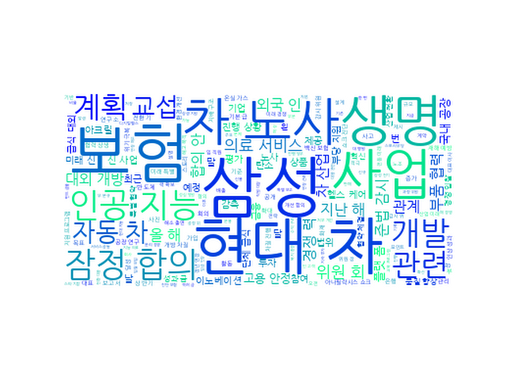

## Daily News Monitoring 

2021-07-21 

----------

### Daily Hot Keywords 

----------

*[ESG 소식]*

1. 삼성 준법위 "단체급식 대외개방 진행상황 모니터링" [0] ([Link](https://news.naver.com/main/read.naver?mode=LSD&mid=sec&sid1=101&oid=031&aid=0000612023))

2. 삼성 준법위 "구내식당 개방·경쟁입찰 당부…모니터링할 것" [2] ([Link](https://news.naver.com/main/read.naver?mode=LSD&mid=sec&sid1=101&oid=001&aid=0012538468))

3. 삼성 준법위원회 "급식 대외개방 차질없이 진행해야" [1] ([Link](https://news.naver.com/main/read.naver?mode=LSD&mid=sec&sid1=101&oid=008&aid=0004619298))

4. 삼성 준법위 "단체급식 개방 차질없이 진행 당부"…ESG 활동 첫 보고 [1] ([Link](https://news.naver.com/main/read.naver?mode=LSD&mid=sec&sid1=101&oid=018&aid=0004990156))

5. 삼성 준법위 "단체급식 대외개방 차질없이 진행돼야" [1] ([Link](https://news.naver.com/main/read.naver?mode=LSD&mid=sec&sid1=101&oid=421&aid=0005490812))

6. SK이노 "탄소배출 10년내 절반으로…2050년 100% 감축“(종합) [1] ([Link](https://news.naver.com/main/read.naver?mode=LSD&mid=sec&sid1=101&oid=003&aid=0010618755))

7. 삼성준법위 "단체급식 개방 차질없이…지속 모니터링할 것" [0] ([Link](https://news.naver.com/main/read.naver?mode=LSD&mid=sec&sid1=101&oid=629&aid=0000096079))

----------

*[금융 소식]*

1. '1조 원대 사기' 김재현 옵티머스 대표 1심 징역 25년 [1] ([Link](https://news.naver.com/main/read.naver?mode=LSD&mid=sec&sid1=102&oid=052&aid=0001616868))

2. 현대차, 2021년 임단협 잠정합의안 도출…'3년 연속 무분규' [6] ([Link](https://news.naver.com/main/read.naver?mode=LSD&mid=sec&sid1=101&oid=629&aid=0000096080))

3. "車산업 위기 공감"…현대차 노사, 올해 임단협 잠정합의(종합) [75] ([Link](https://news.naver.com/main/read.naver?mode=LSD&mid=sec&sid1=103&oid=018&aid=0004990163))

4. 현대차 노사, 임단협 잠정합의…노조, 27일 찬반투표 실시(종합) [2] ([Link](https://news.naver.com/main/read.naver?mode=LSD&mid=sec&sid1=103&oid=421&aid=0005490846))

5. 현대차 3년 연속 무분규 잠정합의…기본급 7만5천원 인상(종합) [95] ([Link](https://news.naver.com/main/read.naver?mode=LSD&mid=sec&sid1=102&oid=001&aid=0012538475))

6. 현대차 노사, 임단협 잠정 합의…3년 연속 무분규 지켰다 [0] ([Link](https://news.naver.com/main/read.naver?mode=LSD&mid=sec&sid1=103&oid=092&aid=0002228337))

7. 현대차 노사, 17번 만남 끝에 임단협 잠정합의…“정년연장 대신 임금인상” [109] ([Link](https://news.naver.com/main/read.naver?mode=LSD&mid=sec&sid1=101&oid=469&aid=0000618587))

----------

*[당사 소식]*

1. [단독] '코로나 백신보험' 봇물…생보협 "명칭 제대로 써라" [1] ([Link](https://news.naver.com/main/read.naver?mode=LSD&mid=sec&sid1=101&oid=243&aid=0000014628))

2. 아크릴, 한림대강남성심병원·파인헬스케어와 AI 의료 서비스 공동 개발 [0] ([Link](https://news.naver.com/main/read.naver?mode=LSD&mid=sec&sid1=105&oid=030&aid=0002958799))

3. 아크릴-한림대병원-파인헬스케어, AI 의료 서비스 협력 [0] ([Link](https://news.naver.com/main/read.naver?mode=LSD&mid=sec&sid1=101&oid=003&aid=0010617965))

4. [AI]아크릴, 한림대병원·파인헬스케어와 `AI 의료서비스` 공동개발 [0] ([Link](https://news.naver.com/main/read.naver?mode=LSD&mid=sec&sid1=105&oid=018&aid=0004989691))

5. 아크릴, AI 의료서비스 공동 개발 착수 [0] ([Link](https://news.naver.com/main/read.naver?mode=LSD&mid=sec&sid1=105&oid=016&aid=0001863974))

----------

*[보험 소식]*

1. 전남 여수서, 언덕길 탁송 차량 ‘횡단보도’ 덮쳐 3명 숨지고 9명 중경상 [4] ([Link](https://news.naver.com/main/read.naver?mode=LSD&mid=sec&sid1=102&oid=277&aid=0004940652))

2. 오늘의 인사 - 2021년 7월 21일 [0] ([Link](https://news.naver.com/main/read.naver?mode=LSD&mid=sec&sid1=102&oid=032&aid=0003086788))

3. “펀드·보험·자산관리로 금융 영역 확장” 자신감 내비친 카카오뱅크 [0] ([Link](https://news.naver.com/main/read.naver?mode=LSD&mid=sec&sid1=101&oid=032&aid=0003086783))

4. 오늘의 부고 - 2021년 7월 21일 [0] ([Link](https://news.naver.com/main/read.naver?mode=LSD&mid=sec&sid1=102&oid=032&aid=0003086787))

----------

*[업계 소식]*

1. 2%대 보험사 퇴직연금 수익률, 올 최대 3배 늘었다 [0] ([Link](https://news.naver.com/main/read.naver?mode=LSD&mid=sec&sid1=101&oid=014&aid=0004678242))

2. 한달간 외국인 고객 4000명↑, 삼성생명 영업비결은 [0] ([Link](https://news.naver.com/main/read.naver?mode=LSD&mid=sec&sid1=101&oid=014&aid=0004678241))

3. 삼성화재, ESG 경영 가속··· 2030년까지 투자 10조로 확대 [0] ([Link](https://news.naver.com/main/read.naver?mode=LSD&mid=sec&sid1=101&oid=011&aid=0003939222))

4. 한화‧KDB생명, IFRS17 도입에 특히 ‘취약’ [0] ([Link](https://news.naver.com/main/read.naver?mode=LSD&mid=sec&sid1=101&oid=031&aid=0000612009))

5. [생활의 여유] 행사 [0] ([Link](https://news.naver.com/main/read.naver?mode=LSD&mid=sec&sid1=103&oid=082&aid=0001108220))

6. 러·몽골 출신 외국인 설계사들 '보험퀸 뺨치네'…月 10건씩 폭풍 계약 [5] ([Link](https://news.naver.com/main/read.naver?mode=LSD&mid=sec&sid1=101&oid=015&aid=0004580890))

