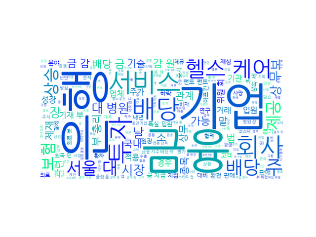

## Daily News Monitoring 

2021-12-03 

----------

### Daily Hot Keywords 

----------

*[ESG 소식]*

1. 오늘의 인사 - 2021년 12월 3일 [0] ([Link](https://news.naver.com/main/read.naver?mode=LSD&mid=sec&sid1=102&oid=032&aid=0003114047))

----------

*[금융 소식]*

1. 상속세, 최대 10년까지 나눠 낸다…미술품 물납 허용 [0] ([Link](https://news.naver.com/main/read.naver?mode=LSD&mid=sec&sid1=101&oid=018&aid=0005099224))

2. 이재근 국민은행장 내정자, "내년 가계대출 성장 5% 이하...새 활로 모색" [0] ([Link](https://news.naver.com/main/read.naver?mode=LSD&mid=sec&sid1=004&oid=123&aid=0002261182))

----------

*[보험 소식]*

1. 특별기여자 “영주 자격 부푼 꿈” 특별체류자 “취업도 못 해 불안” [18] ([Link](https://news.naver.com/main/read.naver?mode=LSD&mid=sec&sid1=102&oid=081&aid=0003234757))

2. 홍남기 “아들 입원 특혜 아냐…서울대병원에 청탁 안해" [211] ([Link](https://news.naver.com/main/read.naver?mode=LSD&mid=sec&sid1=101&oid=018&aid=0005099222))

3. 홍남기 아들 특혜 입원?…기재부 "남아 있던 특실 사용한 것" [75] ([Link](https://news.naver.com/main/read.naver?mode=LSD&mid=sec&sid1=101&oid=003&aid=0010868367))

4. 홍남기 부총리 아들 특혜 입원?...기재부 "남은 특실 사용한 것" [6] ([Link](https://news.naver.com/main/read.naver?mode=LSD&mid=sec&sid1=102&oid=008&aid=0004678589))

----------

*[보험 헬스케어 소식]*

1. [시황] 코스피, 외국인 매수에 강세 마감…1.57%↑ [1] ([Link](https://news.naver.com/main/read.naver?mode=LSD&mid=sec&sid1=101&oid=629&aid=0000119469))

2. [시황종합]코스피 1.57%↑ 2940선 회복…대장주 三電 7.5만원 넘어 [9] ([Link](https://news.naver.com/main/read.naver?mode=LSD&mid=sec&sid1=101&oid=421&aid=0005761284))

3. 운동코칭 받고 당뇨관리까지… AI서비스도 '구독시대' [0] ([Link](https://news.naver.com/main/read.naver?mode=LSD&mid=sec&sid1=101&oid=014&aid=0004749535))

4. 서학개미, 美 배당주 `눈독`...배당킹 기업은 이것 [3] ([Link](https://news.naver.com/main/read.naver?mode=LSD&mid=sec&sid1=101&oid=215&aid=0001001035))

5. 신한-KB, 헬스케어 분야에서도 선두 경쟁 [1] ([Link](https://news.naver.com/main/read.naver?mode=LSD&mid=sec&sid1=101&oid=015&aid=0004635905))

6. 은행도 네이버·카카오처럼…"부동산·쇼핑 자회사 인수 허용해야" [2] ([Link](https://news.naver.com/main/read.naver?mode=LSD&mid=sec&sid1=101&oid=008&aid=0004678516))

7. 큐렉소, 의료로봇 매출 7배 늘어도 주가는 반토막..."제조업 아닌 헬스케어로 봐야" [3] ([Link](https://news.naver.com/main/read.naver?mode=LSD&mid=sec&sid1=101&oid=018&aid=0005099039))

----------

*[업계 소식]*

1. 삼성생명 지분 1.73% 블록딜 처분…2200억원 규모 [4] ([Link](https://news.naver.com/main/read.naver?mode=LSD&mid=sec&sid1=101&oid=277&aid=0005009593))

----------

*[헬스케어 소식]*

1. [과기정통 뉴스] 무보, ESG 시범사업 참여 우수 기업에 무역보험 인센티브 제공 外 [0] ([Link](https://news.naver.com/main/read.naver?mode=LSD&mid=sec&sid1=101&oid=082&aid=0001130310))

2. 금감원, 하나은행 사모펀드 제재심 또 결론 못내…추후 속개 [2] ([Link](https://news.naver.com/main/read.naver?mode=LSD&mid=sec&sid1=101&oid=031&aid=0000640186))

3. “낮춰줄 줄 알았는데…” 금감원, 하나銀 제재 결론 또 못내 [6] ([Link](https://news.naver.com/main/read.naver?mode=LSD&mid=sec&sid1=101&oid=018&aid=0005099196))

4. 금감원, "하나은행 제재심 추후 결론" [0] ([Link](https://news.naver.com/main/read.naver?mode=LSD&mid=sec&sid1=101&oid=014&aid=0004749681))

5. 금감원, 하나은행 제재심 결론 못내...추후 속개 [0] ([Link](https://news.naver.com/main/read.naver?mode=LSD&mid=sec&sid1=101&oid=123&aid=0002261172))

6. 금감원, 하나은행 제재심 결론 못내…"추후 속개" [2] ([Link](https://news.naver.com/main/read.naver?mode=LSD&mid=sec&sid1=101&oid=277&aid=0005009598))

7. '사모펀드 사태' 하나은행 제재심 결론 또 못내... 금감원 "추후 속개" [2] ([Link](https://news.naver.com/main/read.naver?mode=LSD&mid=sec&sid1=101&oid=469&aid=0000644662))

