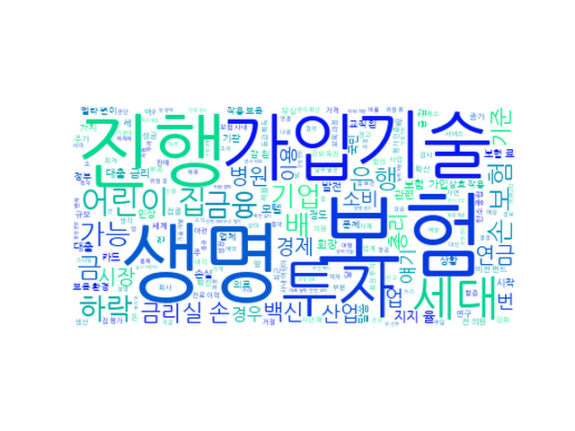

## Daily News Monitoring 

2021-07-20 

----------

### Daily Hot Keywords 

----------

*[ESG 소식]*

1. [미리보는 이데일리 신문]지지부진 공공재건축, 재초환 완화해준다 [0] ([Link](https://news.naver.com/main/read.nhn?mode=LSD&mid=sec&sid1=102&oid=018&aid=0004989203))

2. 남부발전, 한국생산기술연구원과 탄소중립·산업안전 위한 업무협약 [0] ([Link](https://news.naver.com/main/read.nhn?mode=LSD&mid=sec&sid1=102&oid=417&aid=0000716492))

3. ‘범농협ESG추진위원회’ 첫 발 [0] ([Link](https://news.naver.com/main/read.nhn?mode=LSD&mid=sec&sid1=101&oid=022&aid=0003601787))

----------

*[금융 소식]*

1. ‘백신·올림픽·술’ 삼재에 발목... 스가 지지율 20%대로 급락 [25] ([Link](https://news.naver.com/main/read.nhn?mode=LSD&mid=sec&sid1=104&oid=023&aid=0003627874))

2. 뉴욕증시, 코로나19 델타 변이 우려에 하락 출발 [15] ([Link](https://news.naver.com/main/read.nhn?mode=LSD&mid=sec&sid1=101&oid=001&aid=0012535611))

----------

*[당사 소식]*

1. 라이나생명 사내 어린이집, 평가 인증 '최고 등급' 획득 [0] ([Link](https://news.naver.com/main/read.nhn?mode=LSD&mid=sec&sid1=101&oid=030&aid=0002958564))

2. 라이나생명 사내어린이집, 평가 인증 '최고 등급' 획득 [0] ([Link](https://news.naver.com/main/read.nhn?mode=LSD&mid=sec&sid1=101&oid=014&aid=0004676989))

3. 라이나생명 사내어린이집, 평가 인증 ‘최고 등급’ [1] ([Link](https://news.naver.com/main/read.nhn?mode=LSD&mid=sec&sid1=101&oid=016&aid=0001863249))

4. 라이나생명, 사내어린이집 평가 인증 `최고 등급` 획득 [0] ([Link](https://news.naver.com/main/read.nhn?mode=LSD&mid=sec&sid1=101&oid=018&aid=0004988669))

----------

*[보험 소식]*

1. [뉴스하이킥] "4세대 실손보험, 2년 내 외래진료 받았으면 가입 거절당할 수도" [0] ([Link](https://news.naver.com/main/read.nhn?mode=LSD&mid=sec&sid1=100&oid=214&aid=0001136844))

2. KB캐피탈, 'KB차차차 내차고' TV CF 온에어 [0] ([Link](https://news.naver.com/main/read.nhn?mode=LSD&mid=sec&sid1=101&oid=003&aid=0010616364))

3. 제2금융권 가계대출 ‘풍선효과’···부실 위험 경고등 [0] ([Link](https://news.naver.com/main/read.nhn?mode=LSD&mid=sec&sid1=101&oid=032&aid=0003086498))

4. '2년 내 외래진료도 안돼'…실손 가입 거절 제동 [1] ([Link](https://news.naver.com/main/read.nhn?mode=LSD&mid=sec&sid1=101&oid=422&aid=0000495743))

----------

*[업계 소식]*

1. 대출 금리 1년새 1%p 상승…기준금리 인상 시 이자 부담 커질 듯 [10] ([Link](https://news.naver.com/main/read.nhn?mode=LSD&mid=sec&sid1=101&oid=374&aid=0000251413))

2. [증시이슈] 삼성생명, 즉시연금 소송 1심 결론 앞두고 하락세 [0] ([Link](https://news.naver.com/main/read.nhn?mode=LSD&mid=sec&sid1=101&oid=243&aid=0000014593))

